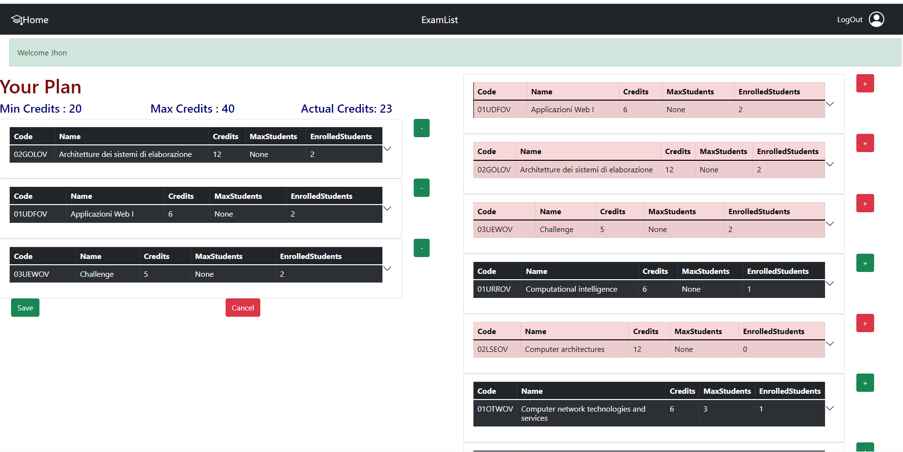

# Exam #1: "StudyPlan"
## Student: s295220 Marra Benito 

## React Client Application Routes

- Route index `/`: It renders the Home.js file which has the purpouse to handle the unlogged page and the part of the plan creation for the logged users
- Route `/login`: It renders  the Login.js file which has a Login form(mail and password) and login operations
- Route `/plan`: It renders  the Plan.js file which handle the logged-in users which already have a plan created(or just created one)

## API Server

- POST `/api/login`
  - request parameters: credentials(username and password)
  - response body content: user as JSON object
- DELETE `/api/logout` 
  - response body: None
  - request body : None
- GET `/api/sessions/current`
  - response body: user as JSON object.
- GET `/api/exams/`
  - request parameters: None.
  - response body content: ExamList as JSON objects.
- GET `/api/exams/incompatibilities/:id`
  - request parameters: The id of the exam.
  - response body content: List of the codes of all the incompatibility courses for the exam.
- GET `/api/exams/studyplan/:id`
  - request parameters: Id of the user.
  - response body content: List of all the exams that belong to the StudyPlan as JSON objects.
- DELETE `/api/exams/studyplan/:id`
  - request parameters: id of the user.
  - response body content: None.
 - PUT `/api/exams/studyplan/:id`
   - request parameters: Id of the user.
   - request body: A JSON object containing the kind of plan that needs to be updated.
   - response body content: None.
- GET `/api/exams/user/studyplan/:id`
  - request parameters: Id of the user.
  - response body content: A JSON object containing the kind of plan that the user has.
- POST `/api/exams/add`
  - request parameters:None.
  - request body: A  JSON object containing the userId and the Code of the exam that needs to be inserted in the studyplan.
  - response body content: None.
- DELETE `/api/exams/studyplan/del/:code`
  - request parameters: code of the exam that has to be deleted from the studyplan and the credentials of the user.
  - response body content: None.
 - PUT `/api/exams/plusenroll`
   - request parameters: None.
   - request body content: A JSON object containing the code of the exam that needs to be updated.
   - response body content: None.
 - PUT `/api/exams/lessenroll`
    - request parameters: None.
    - request body content: A JSON object containing the code of the exam that needs to be updated.
    - response body content: None.
 

## Database Tables

- Table `users` - contains id, email, name, hash, salt, studyplan. Studyplan is used to set if a user has already a plan in a db, null otherwise.
- Table `Exams` - contains Code, Name, Credits, MaxStudents, EnrolledStudents, PreparatoryCourse. This table is used to store information about each exam.
- Table `Constrictions` - contains ExamCode, IncompatibleCode. Table to describe the array of incompatible courses for a single Exam Code.
- Table `StudyPlan` - contains UserId,ExamCode. Table to show for each userId the list of all exams of his plan.

## Main React Components

- `ExamNavbar` (in `/components/ExamNavbar.js`): It's the Navbar of the entire application, has a left image that if clicked redirect to the main page, a title "ExamList" and a Login Button that becomes LogOut when the user is logged.
- `ExamTable` (in `/components/ExamTable.js`): It's the main component to visualize the Exams both in edit or in normal mode, it calls ExamAccordion to create an Accordion for each exam downloaded from the DB.
- `ExamAccordion` (in `/components/ExamAccordion.js`): It creates an Accordion(main react Component) with a Table in the Accordion Header containing all the main infos about the Exam and a table in the Accordion Body containing the Preparatory and Incompatible Courses.
- `ExamTableHeader` (in `/components/ExamTableHeader.js`): It takes all the header of the Accordion Header Table and renders them.
- `ExamRow` (in `/components/ExamTableRows.js`): It takes all the data of the exam and renders them in the Accordion header table.

## Screenshot

## Users Credentials
Those credentials are defined by username(the email) and  the password
- user1@email.com, prova       
  - This user is the one with the PartTime Studyplan
- user2@email.com, prova       
  - This user is the one with the FullTime Studyplan
- user3@email.com, prova       
  - This user has no StudyPlan
- user4@email.com, prova       
  - This user has no StudyPlan
- user5@email.com, prova       
  - This user has no StudyPlan
